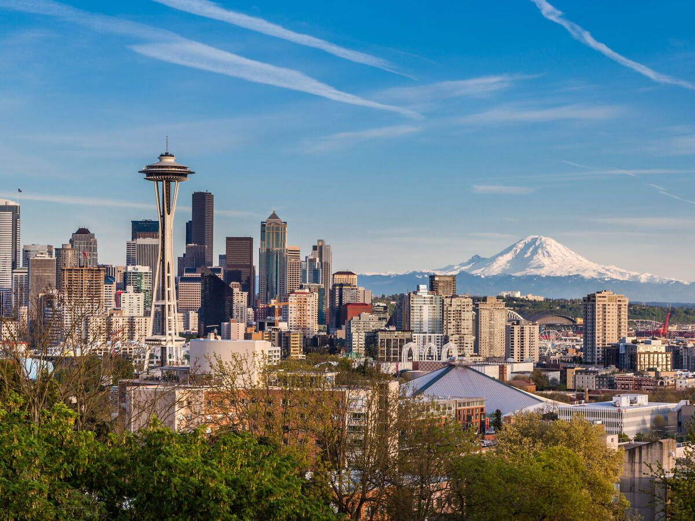

## Exploring Seattle’s Airbnb Scene Through Data: What I Found About Listings, Prices, and Reviews

Ever wondered what the Airbnb landscape in Seattle looks like? Well, I dove into a dataset packed with listings and reviews, crunched the numbers, and visualized the insights. Here’s what I discovered—from popular property types to the best time to visit Seattle!

**What Kinds of Places Can You Rent in Seattle?**

Seattle’s Airbnb options are diverse, ranging from cozy rooms to entire houses. After analyzing the distribution of property types, I found that apartments dominate the market, followed by houses. It makes sense because of Seattle’s urban core is dense with apartment complexes, but there’s still a decent chunk of larger homes available for rent. 🏠

🧐 From the traveler data, I believe apartments is the most common option for them and thus it make up the largest portion of the listings. The bar chart below showed that apartments were by far the most frequent type of Airbnb listing, followed by houses.

*The distribution of property types in Seattle's Airbnb listings.*

**Where Are Most Airbnbs Located?**

Seattle’s neighborhoods vary in charm, from the urban cool of Capitol Hill to the waterfront beauty of Ballard. But where are most Airbnbs clustered?

In my analysis, Capitol Hill took the crown as the neighborhood with the highest number of listings. This isn’t surprising—it’s close to downtown, packed with nightlife, and known for its artsy vibe.

If you’re booking an Airbnb in Seattle, chances are you’ll find plenty of options in Capitol Hill, which leads in the number of listings.

*Top 10 neightborhoods by number of listings.*

**How Much Do Airbnbs in Seattle Cost?**

Let’s talk money 💰. I analyzed the price distribution across Seattle’s Airbnbs, and the results were pretty diverse. The majority of listings fall between \$75 and \$150 per night, but prices can vary dramatically, with some luxury properties going as high as \$1,000 per night.

Most Airbnbs cost between \$75 and \$150 per night, but there are outliers—especially in premium neighborhoods like Capitol Hill or near waterfront areas.

**Room Types: Entire Place vs. Shared Spaces**

One of the most interesting parts of Airbnb is the variety in room types. Some people are all about booking an entire home, while others don’t mind sharing a room. In Seattle, entire homes are by far the most popular option, followed by private rooms.

If you’re the type who values privacy, Seattle has plenty of entire homes and apartments for you to choose from.

Entire homes or apartments dominate Seattle’s Airbnb listings, accounting for the majority of room types.

**Availability: When’s the Best Time to Visit?**

Availability data revealed that Seattle Airbnbs have a significant variation in booking patterns. The estimated annual occupancy rate was around 32.94%, meaning that, on average, properties are available about two-thirds of the year. However, if you’re planning to visit in the summer, you might want to book early, as that’s the busiest time!

The occupancy rate is around 33%, which means most properties are available for a good portion of the year—but expect summer to be competitive!

**What Do Guests Think?**

I also looked at reviews to get a sense of how guests feel about their stays. Review scores tend to be pretty high, with most ratings clustering around the upper end of the scale. It seems like guests are generally happy with their stays in Seattle.

Review scores are overwhelmingly positive, with the majority of listings scoring 80 or above out of 100.

**When Do People Leave the Most Reviews?**

Reviews are a great way to gauge guest satisfaction, and interestingly, the number of reviews follows a clear trend over time. There was a significant spike in review activity between 2010 and 2015, with the highest volume of reviews in August 2015.

Reviews peaked in August, showing that summer months are not only the busiest but also when people are most likely to leave feedback.

My conclusion: Seattle Airbnb Scene in a Nutshell 🌆

Seattle’s Airbnb landscape is vibrant and diverse, offering something for every kind of traveler. Whether you’re looking for a budget-friendly apartment or a luxurious waterfront home, there’s no shortage of options. Most listings are located in Capitol Hill, and if you’re visiting in the summer, get ready to book early and possibly pay a premium!

This was a fun deep dive into Seattle’s Airbnb market. Hopefully, it helps you make more informed decisions when planning your next trip to the Emerald City. 🏙️

*Acknowledgments:*
I’d like to thank the Airbnb team for making their data available for public use. This dataset is part of Airbnb Inside, and the original source can be found [here](http://insideairbnb.com/get-the-data.html).
