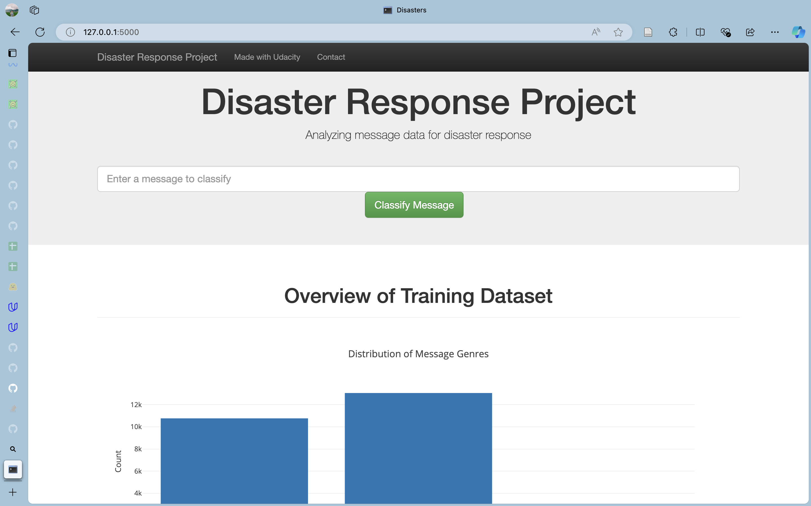

# Disaster Response Pipeline Project

## Project Description
In this project, we aim to develop a model that classifies messages sent during disaster situations into one or more of 36 predefined categories, such as Aid Related, Medical Help, and Search and Rescue. By accurately categorizing these messages, we can ensure they are directed to the appropriate disaster response organizations. The project will include building a basic ETL (Extract, Transform, Load) process and a Machine Learning pipeline to support the classification task.

Since messages can fall into multiple categories, this is a multi-label classification problem. We will be working with a dataset provided by [Figure Eight](https://www.figure-eight.com/) that contains real messages sent during disaster events.

## Project Structure
```
.
├── ETL Pipeline Preparation.ipynb
├── ML Pipeline Preparation.ipynb
├── README.md
├── app
│   ├── run.py
│   └── templates
│       ├── go.html
│       └── master.html
├── cls.pkl
├── data
│   ├── DisasterResponse.db
│   ├── Twitter-sentiment-self-drive-DFE.csv
│   ├── categories.csv
│   └── messages.csv
├── process_data.py
├── requirements.txt
└── train_classifier.py
```

## Installation
Install dependencies packages by running the following command:
```bash
pip install -r requirements.txt
```

## Getting Started
Run the following commands in the project's root directory to set up your database and model.
**1. To run ETL pipeline that cleans data and stores in database**
```bash
python data/process_data.py data/disaster_messages.csv data/disaster_categories.csv data/DisasterResponse.db
```
**2. To run ML pipeline that trains classifier and saves**
```bash
python models/train_classifier.py data/DisasterResponse.db models/classifier.pkl
```
**3. To run the web app**
```bash
python app/run.py
```

## Screenshots

*Homepage*


*Test on a simple usecase*


## Licensing, Authors, Acknowledgements
Thanks Figure-8 for making this available to Udacity for training purposes.
