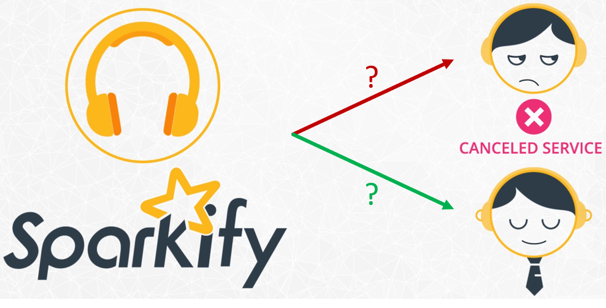
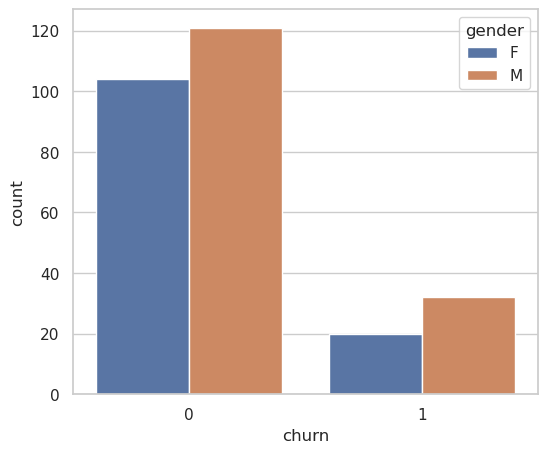
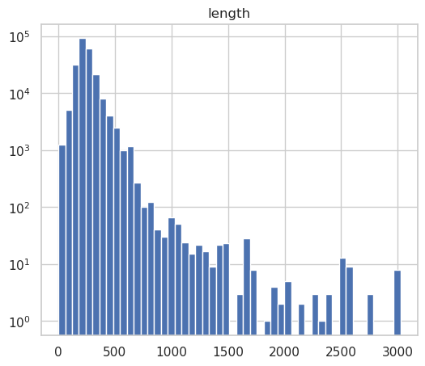
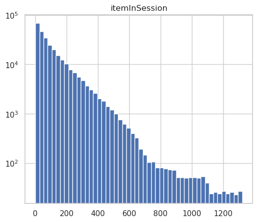
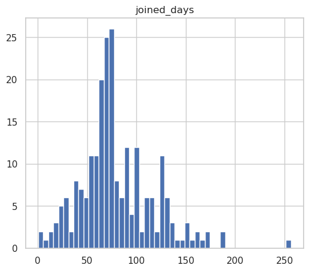
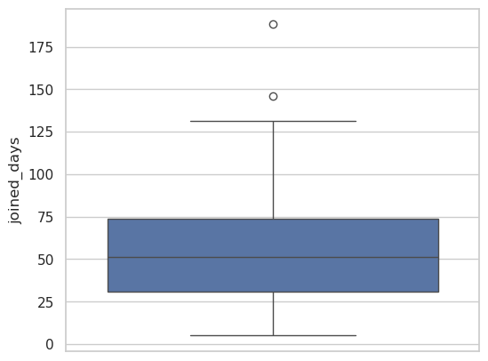
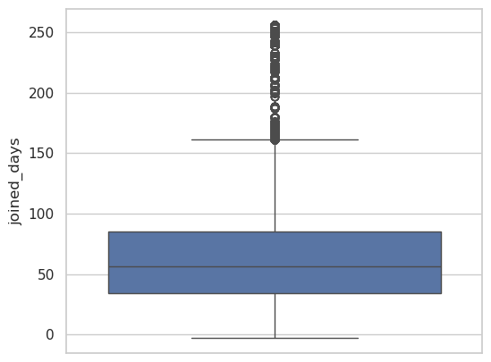
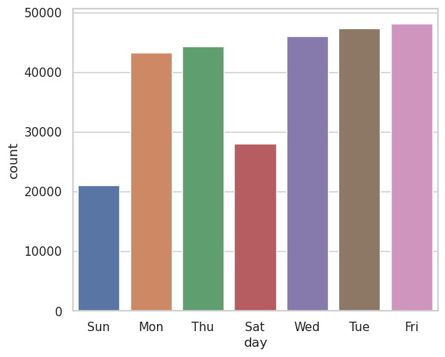
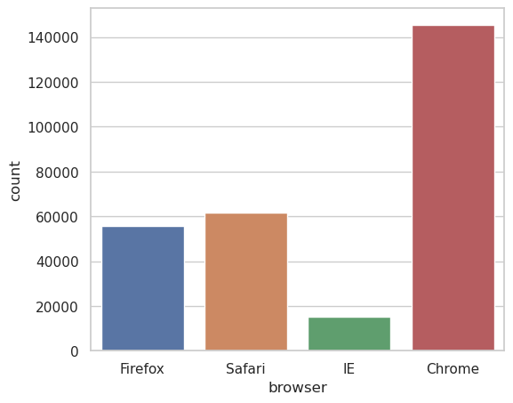
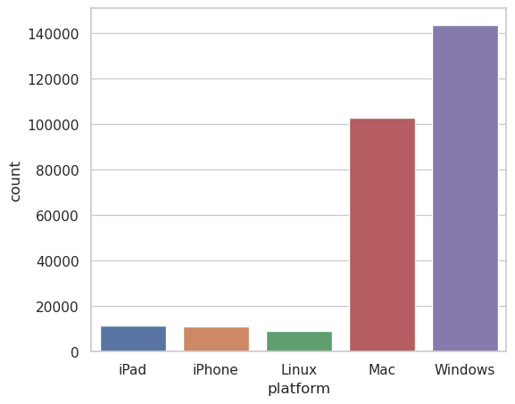

# Sparkify: Predicting Churn with Big Data Magic

When I first embarked on the Sparkify project, I felt like an explorer venturing into uncharted data territories. The mission? To predict when users of a music streaming platform would cancel their subscriptions (or “churn”). It was a perfect blend of big data and machine learning—an adventure tailor-made for a data enthusiast like me.

## The Call to Action: Why Predict Churn?

Sparkify’s dataset was rich with user interaction logs—songs played, skips, likes, and even advertisements encountered. This data was more than just numbers; it held the key to understanding user satisfaction. 

Below is a sample of the dataset, acknowledged that the data is not ML-ready which can contain noisy instance, null, un-preprocessed values and categorical features can not be input directly to ML model. In order to predict churn accurately, I first need to clean and preprocess the data.

## Taming the Data Beast

The dataset contains with more than 286k rows and 18 columns, representing user behaviors. Cleaning this data included:
- Handling missing values,
- Standardizing formats,
- and creating new features that could capture the nuances of user activity.

Using Apache Spark, I transformed raw logs into structured data that was ready for analysis. For example, I calculated:
	•	Session length: How long users stayed engaged.
	•	Engagement scores: Combining actions like thumbs-ups and song skips.
	•	Churn events: Labeling users based on whether they canceled their subscriptions.

## Data Stories and Insights

With the data ready, I dove into exploratory analysis. Below are some of the insights I uncovered:

**Gender and Churn**: Since the dataset contain gender information, I wonder if there is any difference in churn rate between genders. It's turn out that females were more likely to churn than males. This could be due to various factors such as differences in user preferences, pricing, or marketing strategies.

*Comparison of gender effect on churn.*

**Song Length and Churn**: I also looked at the length of songs played by users. Users who played longer songs were more likely to churn. This could be due to various factors such as user satisfaction were not matched their preferences or the recommendation system fail to provide relevant recommendations.

| Event length               | Item in session               |
| ---------------------- | ---------------------- |
|  |  |

*Distribution of song length played by users in each session (left). Distribution of number played item in a session (right).*

**Service Usage Duration**: One of hidden feature in this dataset is the duration of service usage by users. The question is users who used the service for a longer duration since the day registration expected to more sticky than those who used the service for a shorter duration. Interestingly, the result shows the opposite, that users who used the service for a longer duration were more likely to churn. 

*Distribution of service using duration by users.*

| Churned users               | Active users               |
| ---------------------- | ---------------------- |
|  |  |

*Comparison of service joining duration since registration between churned users and active users.*

**User Activity Trend**: In order to look at user behavior, I looked at the using trend of users. The first one is the trend of user activity in weekdays. The data indicated a pattern of higher activity on weekdays compared to weekends. This suggests that users are more likely to engage with the service during the workweek.

*Comparision of users activity trend in weekdays.*

The second one is the trend of user activity in what browser and platform. The figure suggests that Sparkify users are more likely to use Chrome browser on a Window or MacOS platform. However, a small portion of users use iPhone or iPad, suggesting potential untapped market for the service.

*Distribution of browser usage by users.*

*Distribution of platform usage by users.*

These insights were not just numbers—they were narratives about user experiences, providing a foundation for building predictive models.

## The Model Development: Predicting Churn
Armed with features derived from user behaviors, I began the modeling phase. I framed the problem as a binary classification task: predicting whether a user would churn (1) or remain active (0). 

The models I explored included:
	•	Logistic Regression: A simple yet effective starting point.
	•	Random Forest: For its ability to handle complex interactions.
	•	SVM: For its ability to handle high-dimensional data.

Through iterative experimentation, I tuned the models using Spark’s MLlib. It turn out a logistic regression are close to Linear SVM model with an F1 score of ~0.76. It balanced precision and recall, ensuring we could identify churners without raising too many false alarms.

## Reflections and Takeaways
This project was more than a technical exercise—it was a journey into the minds of users and the heart of a streaming business. Here’s what I learned:
	•	The Power of Big Data: Apache Spark’s distributed framework made processing large datasets seamless.
	•	Data-Driven Narratives: Visualizing user behaviors provided clarity and context for decision-making.
	•	Modeling with Impact: The logistic regression model wasn’t just accurate; it was actionable, enabling Sparkify to retain at-risk users.

## Limitattions and Future Work
1.	Class Imbalance: With only 23% of users labeled as churned, predicting churners accurately was challenging. Techniques like oversampling and weighted loss functions helped.
2.	Feature Engineering: Creating meaningful features required creativity and patience. For example, I derived a “skip rate” metric to quantify dissatisfaction with the music playlist.

## What’s Next?

This project taught me the art of turning data into strategies. But the journey doesn’t end here. I’m excited to explore ensemble methods, time-series analysis, and even deep learning to enhance predictions further. Most importantly, I’m inspired to apply these skills to real-world challenges, creating data-driven solutions that make a difference.

If you're interested in this project, you can find the code on my GitHub. Feel free to reach out for further discussions.